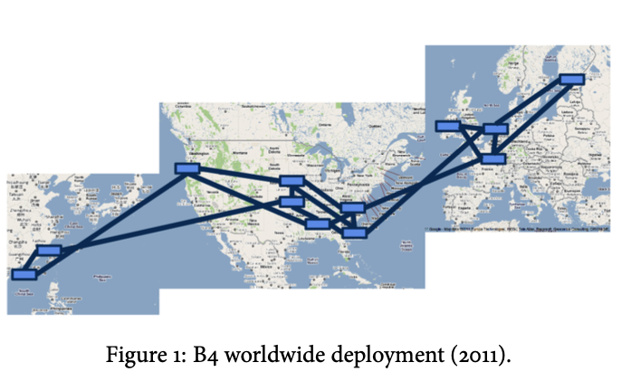
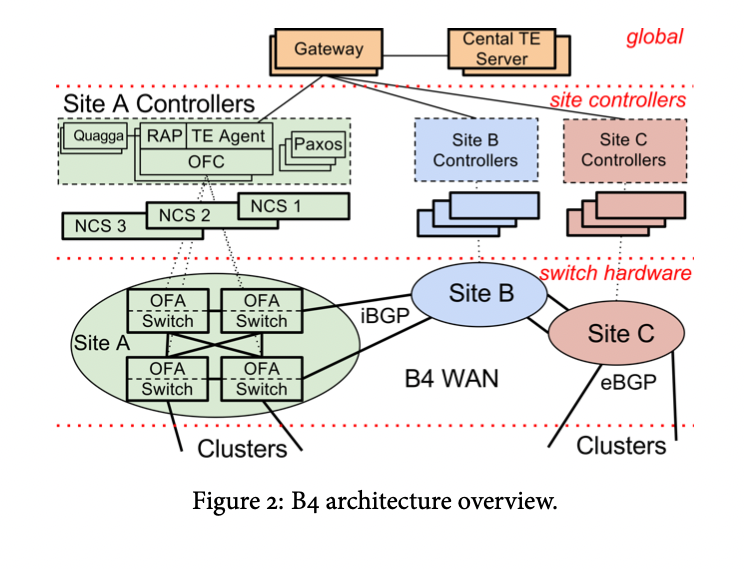
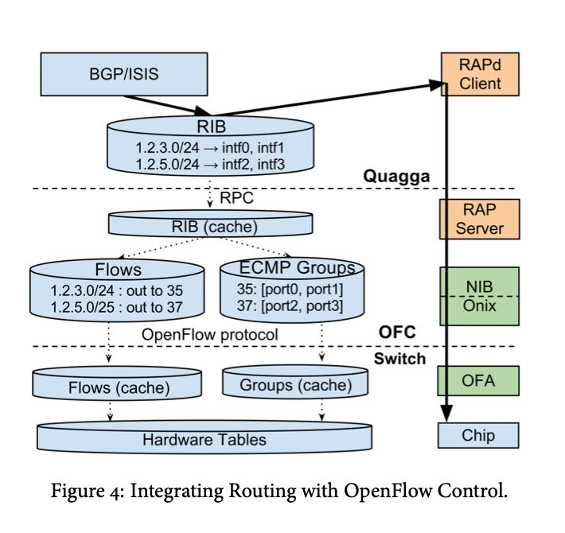

Largest SDN deployment
link: https://storage.googleapis.com/pub-tools-public-publication-data/pdf/41761.pdf  
all images are taken from the paper. Credit goes to authors

# Objectives
- WAN - what are the requirements 
- WAN - problems
- Google SDN: effectiveness, design overview and tradeoffs

# WAN requirements 
## What traffic goes through between DCs?
internal application traffic: asynchronous data copies, index pushes for interactive serving systems, and end user data replication for availability. >90% of internal application traffic runs across this network.  
- Bandwidth demands grow faster. 

3 priorities in decreaing order: increasing volume, decreasing latency sensitivity 
1) user data copies (e.g., email, docs, audio/video files)
2) remote storage access for distributed data sources
3) large-scale data push synchronizing state across multiple data centers.

when failures happen (and they do happen) user traffic is more important than others
  
# Problem $$$
  - need to provision to 30-40% average util 
  - this is 2-3x the cost of a fully- utilized WAN to protect against failures and packet loss
  - high throughput high port density high availabitlty switches will quickly burn through your life savings

so how can we make dirt cheap network while still sattisfying availability requirements. So where can we cut corners?
Differences with public facing network
- Elastic bandwidth demands. Fancy name we don't need to be that available. applications benefit from as much bandwidth as they can get but can tolerate periodic failures with temporary bandwidth reductions. Basically they are saying. Traffic loss is bad but if some developers query to a database takes longs or is lossed. Meh no biggie. They can try again. There is some traffic that is not that critical
- End application control: We control both the applications and the site networks. Can enforce application priorities (QOS) and control bursts at the network edge (get clients behave certain way). Basically we can determine your application or your traffic is not that important. 
- WAN sites - a few dozen. if software can provide this abstraction of 12 node topology and put that computational load on servers, we can get away with dirt cheap switches with shallow buffers, small routing tables and even shabby fault tolerance, because remeber we can drop some traffic.
- in theory we can know demand and importance and topology state (cuz remember we own everything) we can makea globally centrally optimal decision. We can reduce distributed problem to simple algorithm, offload this computation from switches to servers and get away with really cheap and really dumb switches. 

# Architecture

3 powerful abstractions

1. global: really sees 12 node topology and an array of few dozen of [(Demand, priority)...] tuple. Allocate demands on this topology and consider priority. This is a leetcode question. Operates with flow groups and tunnel groups
2. this layer actually sees individual switches and links. Separates this flow into individual with ECMP hashing. Aggregates state info from individual switches into site wide 
3. Open flow is by itself a powerful interface/abstraction layer. It hides vendor specific switch configuration details each with their own proprietary interfaces and scripting languages — to be managed remotely using a single, open protocol. It abstracts these details away into a single standardized interface. 

## Implementation details

# Traffic Engineering
## Vocab
>Network Topology Graph: abstracted away 12 node graph  
>Flow Group (FG): {src -> dst, QoS} tuple. Aggregate of application flows  
>Tunnel (T): site-level path. A->B->C  
>Tunnel Group(TG): map FGs -> {tunnles, weight}  
>Weight: specifies the fraction of FG traffic to fowrard along each tunnel

Given this network topology   
Flow Group1: (A, B, Q0) maps to Tunnel Group: {A->B, 5}, {A->C->B, 4}, {A->D->C->B, 1} 
Flow Group2: (A, C, Q1)

Allocate bandwidth based to FGs based on demand and prioirty. 

There are generally 3 approaches companies choose to manage WAN provisioning costs:
1. invest into software (like google). Build custom solutions for software but use cheap merchant silicon. Here the maintenance and deployment consts are higher but that makes sense for them because they do it well. They have the processes and practices in place to manage this complexity in deployment and maintenance. Google has half a million switches. Less than amazon but they have more traffic flowing though them 
2. invest into hardware (like amazon) and use standard protocols. Just keep adding switches. Amazon has the workforce and that model works for them 
3. hybrid model (like Facebook). Make most of open source protocols, work with vendors to get to a somewhat personalized solution. 

These days these 3 big customers dictate what vendors produce. Innovation wise networking is dead (from vendor supplier perspective). Today customers these big bois come up with new cost effective solutions and define direction for vendors. Do you think vendors came up with this open flow and whole SDN hardware from software disaggregation spiele? Of course not. Its better for vendors to lock in their customer into their ecosystem. SDN and open source and standard protocols come from users, I believe from these big clients who need to manage multiple vendors in their ecosystem in a cost effective way. 